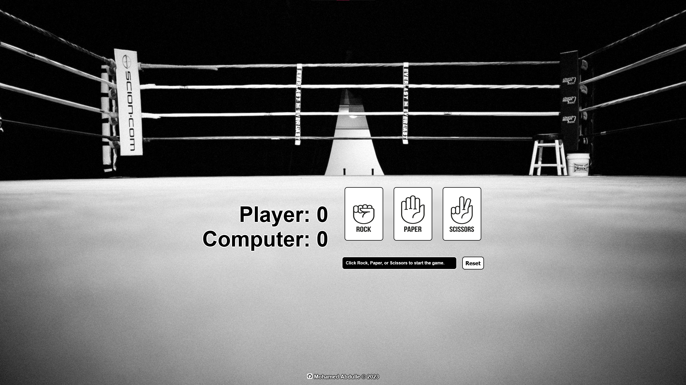

# Rock, Paper, Scissors
A rock, paper, scissors game played against a computer. 

## Links
- [Click here to play rock, paper, scissors](https://mohamedabdulle.github.io/rock-paper-scissors/)

- [Link to the assignment details](https://www.theodinproject.com/lessons/foundations-rock-paper-scissors)

## Description
The game is played for 5 rounds in a best of 5 format. A draw does not count as a round played. 
The scoreboard is updated every round.

## Instructions
Start the game by clicking either rock, paper, or scissors. 
Once 5 rounds have been played (excluding draws), you can replay the game by clicking the reset button.
